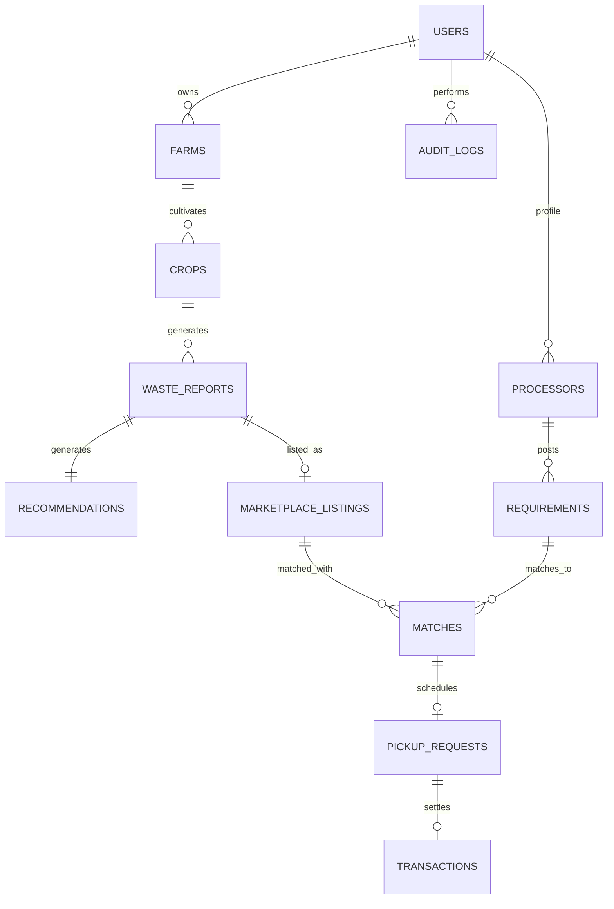

# AGRIVALUE AI — Comprehensive B.Tech Major Project Architecture & Execution Guide
**An AI-Powered Agricultural Waste-to-Value and Marketplace Platform**

---

## 1. Project Overview & Problem Statement

### 1.1 The Real-World Problem
Every harvest season, millions of tons of crop residues (paddy straw, cotton stalks, sugarcane bagasse, vegetable/fruit residues) are openly burned or discarded in landfills. This causes:
- **Severe Environmental Hazards**: Atmospheric smog, particulate pollution ($PM_{2.5}$, $PM_{10}$), and greenhouse gas emissions ($CO_2$, $CH_4$).
- **Soil Degradation**: Burning destroys essential microbial flora, organic carbon, and soil moisture.
- **Economic Loss**: Farmers spend money clearing fields rather than earning additional revenue from by-products.

### 1.2 The AgriValue AI Solution
AgriValue AI is an **IT-only, software-driven circular economy platform** connecting farmers directly with industrial processors, bio-energy plants, compost producers, and biochar manufacturers.

- **Stack**: **MERN (MongoDB, Express.js, React.js, Node.js)** + **Python FastAPI (PyTorch / scikit-learn)**.
- **No Hardware Dependency**: Fully software-based (No Arduino, ESP32, or IoT sensors required).
- **Core Intelligence**:
  1. **Computer Vision AI**: Automated residue classification with confidence scores (MobileNetV3 / EfficientNet).
  2. **Multi-Criteria Recommendation Engine**: Explainable heuristic and weighted score evaluating economic value, logistics, processor demand, and carbon offset.
  3. **Smart Marketplace & Matching**: Geo-distance and requirement matching between farm waste and processor purchase requests.
  4. **Logistics & Pickup Management**: Lifecycle tracking from listing $\rightarrow$ inquiry $\rightarrow$ scheduled pickup $\rightarrow$ completed transaction.

---

## 2. System Architecture & Tech Stack

```
   ┌───────────────────────────────────────────────────────────┐
   │             AgriValue AI Web Client (React.js)            │
   │  - Farmer Portal   - Processor Marketplace   - Admin CRM  │
   │  - Recharts Data   - Leaflet Geospatial Maps - Tailwind   │
   └─────────────────────────────┬─────────────────────────────┘
                                 │ HTTP / REST / JWT
                                 ▼
   ┌───────────────────────────────────────────────────────────┐
   │            Main Backend: Node.js + Express.js             │
   │  - Auth & Role Middleware (Farmer / Processor / Admin)    │
   │  - Business Logic & Marketplace Matchmaker                │
   │  - Multer Upload Pipeline & Transaction Management        │
   └───────────────┬───────────────────────────┬───────────────┘
                   │ Mongoose                  │ Axios Microservice Proxy
                   ▼                           ▼
   ┌───────────────────────────┐ ┌─────────────────────────────┐
   │     MongoDB Database      │ │   Python FastAPI AI Engine  │
   │  - 12 Normalized Schemes  │ │  - PyTorch / MobileNetV3    │
   │  - Geospatial 2dsphere    │ │  - Waste-to-Value Scorer    │
   │  - Aggregation Pipelines  │ │  - Geo-Clustering (K-Means) │
   └───────────────────────────┘ └─────────────────────────────┘
```

---

## 3. User Roles & Permissions Matrix

| Capability | 👨🌾 Farmer | 🏭 Processor / Buyer | 👨💼 Admin |
|---|:---:|:---:|:---:|
| User Registration & Profile KYC | ✅ | ✅ | System Seeded |
| Farm & Crop Profiling | ✅ | ❌ | View Only |
| AI Waste Image Scanner | ✅ | ✅ (Demo mode) | ✅ (Full access) |
| Waste-to-Value Recommendation View | ✅ | ✅ | ✅ |
| Create Marketplace Listings | ✅ | ❌ | Moderate/Remove |
| Search & Filter Available Waste Listings | View All | Search + Filter | Full Moderation |
| Express Purchase Interest / Matchmaking | Receive Offers | Send Offers | Oversee |
| Schedule & Track Waste Pickups | Update/Confirm | Dispatch/Update | Monitor All |
| Financial & Impact Analytics | Personal Earnings | Procurement Costs | Platform-Wide KPIs |
| User & Processor Verification | ❌ | ❌ | Full KYC Approval |
| Manage Value Pathways & Categories | ❌ | ❌ | Add / Edit / Delete |

---

## 4. 12 MongoDB Database Collections & Relationships



### Schema Definitions

1. **`users`**: Authentication, profile data, role (`farmer`, `processor`, `admin`), phone, verified status.
2. **`farms`**: Linked to `farmerId`. Details include farm name, geo-coordinates (`[longitude, latitude]`), district, state, total acreage, soil type, irrigation type.
3. **`crops`**: Linked to `farmId` and `farmerId`. Crop name, variety, season (Kharif/Rabi/Zaid), sowing date, expected harvest date, estimated production (tonnes).
4. **`wasteReports`**: The central record of generated residue. Includes crop link, waste category, quantity, unit, uploaded image URL, AI classification result (`predictedClass`, `confidence`), and status.
5. **`recommendations`**: Generated from waste reports. Contains scored pathways (Composting, Biochar, Biomass briquettes, Biogas, Animal feed) with explainability breakdown.
6. **`pathways`**: Reference catalog managed by Admin. Defines standard conversion methods, optimal moisture/quantity thresholds, typical economic value ranges (₹/ton), and $CO_2$ offset metrics.
7. **`processors`**: Company details, business license/GST, processor category (e.g. Biomass Briquetting Plant, Bio-CNG Facility, Organic Fertilizer), location coordinates, KYC status.
8. **`requirements`**: Demand posted by processors: target waste types, minimum/maximum quantity, target procurement radius (km), price offer per unit.
9. **`marketplaceListings`**: Published waste inventory with expected pricing, availability window, AI verification badge, and status (`Available`, `Reserved`, `Sold`, `Cancelled`).
10. **`matches`**: Algorithmic match between a listing and a processor demand with match score based on compatibility, distance, quantity, and price.
11. **`pickupRequests`**: Logistics workflow: Scheduled date, driver name, vehicle number, pickup location, real-time stage (`Requested`, `Accepted`, `Dispatched`, `Collected`, `Completed`, `Cancelled`).
12. **`transactions` & `auditLogs`**: Simulated settlement ledger (invoice amount, payment status, settlement date) and platform compliance audit logging.

---

## 5. AI/ML Microservice Architecture

### 5.1 Deep Learning Image Classifier
- **Model Backbone**: MobileNetV3-Small or EfficientNet-B0 fine-tuned on agricultural residue datasets.
- **Initial Supported Classes**:
  1. *Rice Straw (Paddy residue)*
  2. *Wheat Straw*
  3. *Cotton Stalks*
  4. *Maize / Corn Residue*
  5. *Sugarcane Bagasse*
  6. *Groundnut Shells & Residue*
  7. *Tomato & Vegetable Biomass*
- **Explainable Output**: Returns Top-3 prediction classes with Softmax probability percentages and inference latency.

### 5.2 Multi-Criteria Recommendation Scoring Algorithm
$$\text{Score} = (0.30 \times C_{\text{compat}}) + (0.20 \times D_{\text{market}}) + (0.15 \times Q_{\text{suit}}) + (0.15 \times V_{\text{econ}}) + (0.10 \times G_{\text{geo}}) + (0.10 \times E_{\text{carbon}})$$
- **$C_{\text{compat}}$**: Biochemical compatibility of the residue with the pathway.
- **$D_{\text{market}}$**: Live regional processor demand score.
- **$Q_{\text{suit}}$**: Volume threshold fit (e.g., biochar requires $\ge 500\text{kg}$).
- **$V_{\text{econ}}$**: Potential monetary realization index.
- **$G_{\text{geo}}$**: Haversine distance proximity to nearest verified buyers.
- **$E_{\text{carbon}}$**: Avoided burning emissions factor ($kg\ CO_2e$ avoided).

---

## 6. End-to-End Development Roadmap (14 Phases)

- **Phase 1**: Architecture validation, Schema finalization, UI design system setup.
- **Phase 2**: Frontend layout, Tailwind/Glassmorphism theme, Navbar, Sidebar & Role routing.
- **Phase 3**: Express backend server, MongoDB Atlas connection, Mongoose model schemas.
- **Phase 4**: JWT Authentication, Role-based authorization middleware, Password hashing.
- **Phase 5**: Farmer Farm & Crop management CRUD APIs and UI views.
- **Phase 6**: Agricultural Waste reporting module with Multer image upload pipeline.
- **Phase 7**: Python FastAPI AI service setup, MobileNetV3 inference & preprocessing pipeline.
- **Phase 8**: Node.js to FastAPI integration, Live AI scanner UI with confidence gauges.
- **Phase 9**: Multi-Criteria Recommendation scoring engine & explainable UI cards.
- **Phase 10**: Marketplace listings & Processor demand requirement boards.
- **Phase 11**: Algorithmic Matching engine & 6-stage Pickup tracking logistics.
- **Phase 12**: Interactive Dashboards, Recharts data visualization & Leaflet geospatial maps.
- **Phase 13**: End-to-end testing, error boundary handling, seed data generation.
- **Phase 14**: Project packaging, Postman API documentation, Viva preparation guide.

---
*AgriValue AI — B.Tech Major Project Specification Document*
